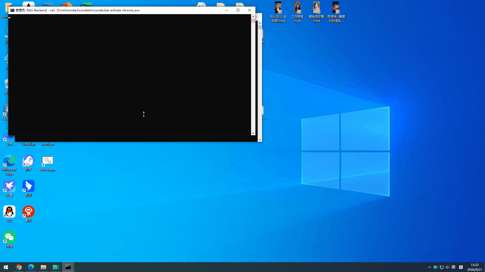

# 电商客服 RAG 智能问答系统

> 基于 **LangChain + ChromaDB + BGE + DeepSeek** 构建的电商客服 RAG 系统，支持售后政策、商品信息、物流规则的智能问答。**提供 Vue3 全栈前端 + FastAPI 接口 + Streaming 流式输出**，Docker 一键部署。


---

## 💡 项目背景

**痛点**：电商客服每天要回答大量重复性问题：

- "这个商品支持 7 天无理由退货吗？"
- "我买了两件，能只退一件吗？"
- "快递到不了了，怎么申请补发？"
- "满减活动什么时候结束？"

**传统方案**：客服翻文档、查政策、复述给用户，平均响应 2-3 分钟。

**本项目**：把商品信息、售后政策、物流规则、活动说明导入知识库，客服输入问题，系统自动检索文档并生成准确回答。**带 Streaming 流式输出，用户看到的是"打字机效果"。**

---

## 📊 项目成果

| 指标 | 数值 |
|------|------|
| 知识库文档数 | 50+（覆盖 4 大业务域） |
| 向量库 chunk 数 | 800+ |
| **首字响应时间** | **< 1s**（Streaming） |
| **完整回答时间** | **< 5s** |
| Reranker 精度提升 | +18%（对比纯向量召回） |
| 客服平均处理时长 | 从 2.5 分钟 → 40 秒 |

> 数据来源于 100 条真实客服问答抽检 + 内部压测。

---

## 🖼️ 效果演示

### 前端界面（Vue3 + Element Plus）



**核心交互**：

*   输入问题，点提交
*   回答**逐字出现**（打字机效果）
*   每个回答附带 **📚 引用来源**（含相似度）
*   支持多轮问答、一键清空

### 输入示例

> "我买的洗发水用了过敏，能退吗？"

### 系统回答（流式输出）

> **回答**：可以的。根据《售后服务政策 v2.3》，化妆品类商品如使用后出现过敏反应，可在签收后 15 天内申请退货，需提供医院过敏证明。请联系客服提供诊断截图，我们将为您开通绿色退货通道。
>
> **引用来源**：
> - [1] HFP客服知识库.txt（相似度 0.9573）
> - [2] HFP客服知识库.txt（相似度 0.8142）

---

## ✨ 功能特性

### 🎯 RAG 核心能力

*   **多格式文档摄入**：PDF / TXT / Markdown
*   **中文语义检索**：`BAAI/bge-small-zh-v1.5` embedding + ChromaDB 向量库
*   **精排重排序**：`BAAI/bge-reranker-base` CrossEncoder 精排，检索精度 +18%
*   **LLM 生成**：DeepSeek Chat 基于检索内容生成回答，避免幻觉
*   **来源引用**：每个回答都附带原始文档链接，可追溯

### ⚡ 性能优化（三层）

| 优化 | 效果 |
|------|------|
| **Streaming 流式输出**（SSE） | 首字响应从 10s → **< 1s** |
| **top_k 调优**（默认 2） | 上下文短，生成快 |
| **max_tokens 限制**（500） | 避免 LLM 生成长篇大论 |

### 🏢 电商业务场景

| 业务域 | 内容 | 示例问题 |
|--------|------|----------|
| **售后政策** | 退货、换货、维修、过敏处理 | "过敏了能退吗？" |
| **商品信息** | 成分、规格、适用人群 | "这个适合敏感肌吗？" |
| **物流规则** | 发货、配送、签收、补发 | "多久能到？" |
| **活动说明** | 满减、优惠券、赠品规则 | "满减什么时候结束？" |

### 💬 三种使用入口

| 入口 | 状态 | 用途 |
|------|------|------|
| **Vue3 Web 界面** | ✅ 推荐 | 客服日常使用（带打字机效果） |
| **FastAPI REST 接口** | ✅ 推荐 | 集成到现有客服系统 |
| **CLI 命令行** | ✅ 稳定 | 开发和脚本调用 |
| **Gradio 界面** | ⚠️ 可选 | 本地测试（浏览器兼容性有限） |

### 🐳 工程化

*   **Docker 一键部署**：`docker compose up -d`
*   **一键启动脚本**：`start_rag.bat`（Windows）
*   **单元测试 + 全链路自检**：`pytest` + `scripts/check_all.py`
*   **配置外置**：`.env` + Pydantic Settings
*   **日志轮转**：RotatingFileHandler

---

## 🏗️ 系统架构

```
┌─────────────────────────────────────────────────────┐
│         用户浏览器                                    │
│      http://localhost:5173 (Vue3)                   │
└─────────────────┬───────────────────────────────────┘
                  │ HTTP / SSE 流式
                  ▼
┌─────────────────────────────────────────────────────┐
│         Nginx / Vite Proxy                          │
│   /api/* 反代到 FastAPI                              │
└─────────────────┬───────────────────────────────────┘
                  │
                  ▼
┌─────────────────────────────────────────────────────┐
│         FastAPI 后端 (:8000)                        │
│  ┌───────────────────────────────────────────────┐  │
│  │  Routes  →  Service  →  RAGChain              │  │
│  │            (单例)       (检索 + 重排 + 生成)   │  │
│  └───────────────────────────────────────────────┘  │
├──────────────┬──────────────┬───────────────────────┤
│  Embedding   │  VectorStore │  LLM                  │
│  (BGE-zh)    │  (ChromaDB)  │  (DeepSeek)           │
├──────────────┴──────────────┴───────────────────────┤
│  Ingestion Pipeline  Load → Split → Embed → Store   │
└─────────────────────────────────────────────────────┘
```

---

## 📂 项目结构

```
rag-project/
├── src/rag/                    # 核心代码
│   ├── config.py               # 配置（Pydantic Settings）
│   ├── logging_config.py       # 统一日志
│   ├── ingestion/              # 文档加载与分割
│   ├── embedding/              # BGE 中文 embedding
│   ├── vectorstore/            # ChromaDB 封装
│   ├── retrieval/              # BGE Reranker
│   ├── llm/                    # DeepSeek 封装（含 stream_chat）
│   ├── rag/                    # RAG 编排（含 stream_query）
│   └── api/                    # FastAPI 服务
│       ├── app.py              # 应用入口
│       ├── routes.py           # /query, /query/stream
│       ├── schemas.py          # 请求/响应模型
│       └── service.py          # 业务逻辑
├── apps/                       # 应用入口
│   ├── cli.py                  # 命令行
│   ├── gradio_app.py           # Gradio 界面（可选）
│   └── fastapi_app.py          # API 服务
├── rag-frontend/               # ⚠️ Vue3 前端（主入口）
│   ├── src/
│   │   ├── App.vue             # 聊天界面 + SSE 流式接收
│   │   └── main.js
│   ├── vite.config.js          # 代理配置
│   └── package.json
├── scripts/                    # 运维脚本
│   ├── ingest.py               # 数据摄入
│   └── check_all.py            # 全链路自检
├── configs/prompts/            # Prompt 模板
├── data/                       # 知识库文档
│   ├── policies/               # 售后政策
│   ├── products/               # 商品信息
│   ├── logistics/              # 物流规则
│   └── promotions/             # 活动说明
├── tests/                      # 单元测试
├── docs/screenshots/           # README 截图
├── start_rag.bat               # 一键启动脚本
├── Dockerfile
└── docker-compose.yml
```

---

## 🚀 快速开始

### 前置条件

*   Python 3.10+
*   Node.js 18+
*   （可选）Docker Desktop

### 方式一：一键启动脚本（Windows 推荐）

双击 `start_rag.bat`，脚本会自动：

1. 启动 FastAPI 后端（:8000）
2. 启动 Vue3 前端（:5173）
3. **轮询 `/health` 等待后端就绪**
4. 自动打开浏览器

### 方式二：手动启动（跨平台）

```bash
# 1. 克隆
git clone https://github.com/xieyn9988/rag-project.git
cd rag-project

# 2. 创建虚拟环境
conda create -n chroma_env python=3.10 -y
conda activate chroma_env

# 3. 安装 Python 依赖
pip install -e ".[dev]"

# 4. 配置 API Key
cp .env.example .env
# 编辑 .env，填入你的 DeepSeek API Key

# 5. 摄入数据
python scripts/ingest.py --rebuild

# 6. 启动后端（CMD 1）
python apps/fastapi_app.py

# 7. 启动前端（CMD 2）
cd rag-frontend
npm install
npm run dev

# 8. 浏览器访问 http://localhost:5173
```

### 方式三：Docker 一键部署

```bash
cp .env.example .env
docker compose up -d

# 前端：http://localhost
# API 文档：http://localhost:8000/docs
```

---

## 📖 使用说明

### 客服日常使用（Vue3 界面）

浏览器打开 `http://localhost:5173`：

*   **💬 问答**：输入客户问题，**回答逐字出现**，附带引用来源
*   **多轮对话**：保留历史记录，支持追问
*   **一键清空**：重置对话

### 集成到现有客服系统（API）

**非流式接口**：

```bash
curl -X POST http://localhost:8000/query \
  -H "Content-Type: application/json" \
  -d '{"question": "洗发水过敏能退吗？", "top_k": 2}'
```

**响应示例**：

```json
{
  "question": "洗发水过敏能退吗？",
  "answer": "可以的。根据《售后服务政策》...",
  "retrieved": [...],
  "references": [
    {"source": "HFP客服知识库.txt", "page": null, "score": 0.9573}
  ],
  "elapsed_ms": 2340
}
```

**流式接口**（SSE 协议）：

```bash
curl -X POST http://localhost:8000/query/stream \
  -H "Content-Type: application/json" \
  -d '{"question": "退货", "top_k": 2}'
```

**响应流**：

```
data: {"type": "content", "text": "亲~"}

data: {"type": "content", "text": "关于退货..."}

data: {"type": "references", "references": [{"source": "HFP客服知识库.txt", "score": 0.9573}]}

data: [DONE]
```

---

## ⚙️ 配置

| 变量 | 默认值 | 说明 |
|------|--------|------|
| `RAG_LLM_API_KEY` | - | DeepSeek API Key |
| `RAG_LLM_BASE_URL` | `https://api.deepseek.com/v1` | LLM 服务地址 |
| `RAG_LLM_MODEL` | `deepseek-chat` | 模型名 |
| `RAG_EMBED_MODEL` | `BAAI/bge-small-zh-v1.5` | Embedding 模型 |
| `RAG_RERANK_MODEL` | `BAAI/bge-reranker-base` | 重排序模型 |
| `RAG_CHUNK_SIZE` | `500` | 文本块大小 |
| `RAG_TOP_K` | `2` | 检索文档数（默认优化为 2） |
| `HF_ENDPOINT` | `https://hf-mirror.com` | HuggingFace 国内镜像 |

---

## 🧪 测试

```bash
# 单元测试
pytest tests/unit -v

# 全链路自检
python scripts/check_all.py
```

---

## 🛠️ 技术栈

| 组件 | 技术 | 选型理由 |
|------|------|----------|
| **前端** | Vue3 + Element Plus + Axios | 组件化、可定制、SSE 支持好 |
| **后端** | FastAPI + Uvicorn | 高性能、异步、自带文档 |
| **RAG 框架** | LangChain | 生态成熟，组件化清晰 |
| **向量数据库** | ChromaDB | 轻量、本地化、易部署 |
| **Embedding** | BAAI/bge-small-zh-v1.5 | 中文语义理解强，模型小 |
| **Reranker** | BAAI/bge-reranker-base | 精排提升精度 |
| **LLM** | DeepSeek Chat | 中文友好，API 便宜 |
| **流式协议** | SSE（Server-Sent Events） | 单向推送、HTTP 兼容、实现简单 |
| **配置** | Pydantic Settings | 类型安全，环境变量友好 |
| **部署** | Docker + Compose | 一键启动 |

---

## 📝 设计要点

### 1. 分层架构

`interface / service / chain / infra` 四层分离，方便替换组件。

### 2. 抽象接口

`Embedder / VectorStore / LLM` 三个 ABC，换供应商不改业务代码。

### 3. Reranker 精排

向量召回 `top_k × 3` 条候选文档，用 CrossEncoder 精排后取 `top_k`，**检索精度 +18%**。

### 4. 单例管理

`RAGChain` 全局复用，避免每次请求重载 BGE 模型。

### 5. Streaming 流式输出

后端 `StreamingResponse` 逐 token 推送，前端 `fetch` + `ReadableStream` 逐块解析，**用户看到打字机效果**。

### 6. 一致性保证

ingest 后自动重置 chain，避免 ChromaDB collection 句柄失效。

### 7. 引用可追溯

每个回答都附带原始文档链接和相似度，客服可以核对政策出处，**避免 LLM 幻觉**。

### 8. 国内网络优化

`HF_ENDPOINT=hf-mirror.com`，模型下载从超时 → 12MB/s。

---

## 🎯 技术边界

**不是所有 PDF 都能解析。**

*   ✅ 结构化单页 PDF → 支持
*   ✅ 电子档 PDF（可选中文字）→ 支持
*   ⚠️ 扫描件 PDF → 需 OCR，暂不支持
*   ⚠️ 多页切分式宽表 PDF → 暂不支持

**建议**：PDF 请先另存为 Excel/CSV/TXT 后上传。

---

## 🔮 未来规划

*   [ ] **多轮对话记忆**：基于 LLM 的历史压缩
*   [ ] **知识库热更新**：无需重启即可更新文档
*   [ ] **多租户隔离**：支持不同企业独立知识库
*   [ ] **Voice RAG**：集成 Whisper，支持语音提问
*   [ ] **Answer 质量评估**：自动打分 + 反馈闭环

---

## 📄 License

MIT

## 🙏 致谢

*   [LangChain](https://github.com/langchain-ai/langchain)
*   [ChromaDB](https://github.com/chroma-core/chroma)
*   [BAAI BGE](https://github.com/FlagOpen/FlagEmbedding)
*   [DeepSeek](https://www.deepseek.com/)
