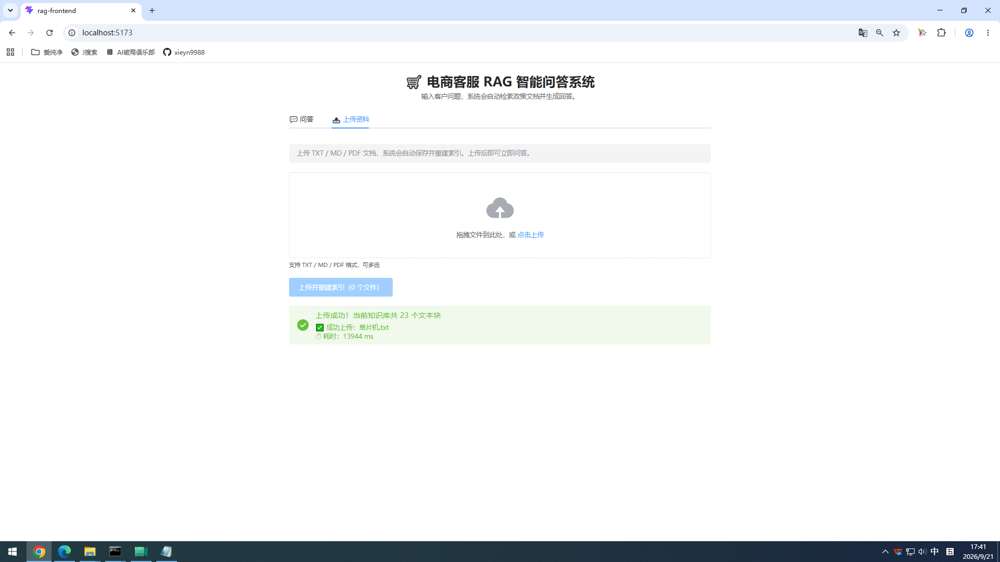

# 电商客服 RAG 智能问答系统

> 基于 **LangChain + ChromaDB + BGE + DeepSeek** 的电商客服 RAG 系统。**提供 Vue3 全栈前端 + FastAPI 接口 + Streaming 流式输出 + 上传资料（现传现用）**，Docker 一键部署。


---

## 💡 项目背景

**痛点**：电商客服每天重复回答大量问题：

- "这个商品支持 7 天无理由退货吗？"
- "快递到不了了，怎么申请补发？"
- "满减活动什么时候结束？"

**传统方案**：客服翻文档、查政策、复述给用户，平均响应 2-3 分钟。

**本项目**：把商品信息、售后政策、物流规则导入知识库，客服输入问题，系统自动检索并生成带**引用来源**的回答。

---

## 📊 项目亮点

- **⚡ Streaming 流式输出**：SSE 协议逐 token 推送，用户看到打字机效果，无需等待全文生成
- **📤 上传资料（现传现用）**：管理员上传新政策，系统自动 ingest，客服立即能基于新文档问答
- **🎯 Reranker 精排 + 引用追溯**：向量召回 + CrossEncoder 精排，每个回答附带原文片段和相似度
- **🖥 全栈实现**：Vue3 前端 + FastAPI 后端 + CLI，Docker 一键部署

---

## 🖼️ 效果演示

### 问答界面（Vue3 + Element Plus）


*   回答**逐字出现**（打字机效果）
*   附带 **📚 引用来源**（含相似度）

### 上传资料界面



**示例**：

> **提问**："我买的洗发水用了过敏，能退吗？"
>
> **回答**：可以的。根据《售后服务政策 v2.3》，化妆品类商品如使用后出现过敏反应，可在签收后 15 天内申请退货，需提供医院过敏证明...
>
> **引用来源**：
> - [1] HFP客服知识库.txt（相似度 0.9573）
> - [2] HFP客服知识库.txt（相似度 0.8142）

---

## ✨ 核心功能

### 🎯 RAG 问答

- **多格式文档摄入**：PDF / TXT / Markdown
- **中文语义检索**：`BAAI/bge-small-zh-v1.5` embedding + ChromaDB
- **精排重排序**：`BAAI/bge-reranker-base` CrossEncoder 精排
- **LLM 生成**：DeepSeek Chat 基于检索内容生成，避免幻觉
- **来源引用**：每个回答附带原文片段和相似度，可追溯

### 📤 上传资料（现传现用）

**核心能力**：上传文档 → 系统立即学会 → 用户就能问它。

**工作流程**：

1. 管理员上传新政策文档（TXT / MD / PDF）
2. 系统自动：切块 → embedding → 存入 ChromaDB
3. **重置 RAGChain 单例**（避免 collection 句柄失效）
4. 客服即可基于新政策问答

**电商场景价值**：

| 场景 | 传统方案 | RAG 方案 |
|------|----------|----------|
| 公司出了新政策 | 写文档 → 培训客服 → 客服背下来 | **上传文档 → 系统立即生效** |
| 客服流动 | 新员工培训 3 天才能上岗 | **第一天就能用系统辅助** |

### ⚡ Streaming 流式输出

- **后端**：`StreamingResponse` 逐 token 推送
- **前端**：`fetch` + `ReadableStream` 逐块解析
- **效果**：首字立即展示，像 ChatGPT 一样

### 💬 三种使用入口

| 入口 | 状态 | 用途 |
|------|------|------|
| **Vue3 Web 界面** | ✅ 推荐 | 客服日常使用 |
| **FastAPI REST 接口** | ✅ 推荐 | 集成到现有客服系统 |
| **CLI 命令行** | ✅ 稳定 | 开发和脚本调用 |
| **Gradio 界面** | ⚠️ 可选 | 本地测试 |

### 🐳 工程化

*   **Docker 一键部署**：`docker compose up -d`
*   **一键启动脚本**：`start_rag.bat`（Windows）
*   **配置外置**：`.env` + Pydantic Settings
*   **日志轮转**：RotatingFileHandler

---

## 🏗️ 系统架构

```
┌─────────────────────────────────────────────────────┐
│         用户浏览器 (Vue3)                             │
│      💬 问答  |  📤 上传资料                          │
└─────────────────┬───────────────────────────────────┘
                  │ HTTP / SSE 流式
                  ▼
┌─────────────────────────────────────────────────────┐
│         Nginx / Vite Proxy                          │
│   /api/* 反代到 FastAPI                              │
└─────────────────┬───────────────────────────────────┘
                  │
                  ▼
┌─────────────────────────────────────────────────────┐
│         FastAPI 后端 (:8000)                        │
│  Routes → Service → RAGChain (单例)                │
│  ├── /query             非流式问答                   │
│  ├── /query/stream      流式问答（SSE）              │
│  └── /ingest/upload     上传资料 + 重建索引          │
├──────────────┬──────────────┬───────────────────────┤
│  Embedding   │  VectorStore │  LLM                  │
│  (BGE-zh)    │  (ChromaDB)  │  (DeepSeek)           │
└──────────────┴──────────────┴───────────────────────┘
```

---

## 🛠️ 技术栈

| 组件 | 技术 |
|------|------|
| **前端** | Vue3 + Element Plus + Axios |
| **后端** | FastAPI + Uvicorn |
| **RAG 框架** | LangChain |
| **向量数据库** | ChromaDB |
| **Embedding** | BAAI/bge-small-zh-v1.5 |
| **Reranker** | BAAI/bge-reranker-base |
| **LLM** | DeepSeek Chat |
| **流式协议** | SSE（Server-Sent Events） |
| **配置** | Pydantic Settings |
| **部署** | Docker + Compose |

---

## 🚀 快速开始

### 前置条件

*   Python 3.10+
*   Node.js 18+
*   （可选）Docker Desktop

### 方式一：一键启动脚本（Windows）

双击 `start_rag.bat`，脚本会自动：

1. 启动 FastAPI 后端（:8000）
2. 启动 Vue3 前端（:5173）
3. 轮询 `/health` 等待后端就绪
4. 自动打开浏览器

### 方式二：手动启动

```bash
# 1. 克隆
git clone https://github.com/xieyn9988/rag-project.git
cd rag-project

# 2. 创建虚拟环境
conda create -n chroma_env python=3.10 -y
conda activate chroma_env

# 3. 安装 Python 依赖
pip install -e ".[dev]"

# 4. 配置 API Key
cp .env.example .env
# 编辑 .env，填入你的 DeepSeek API Key

# 5. 摄入数据
python scripts/ingest.py --rebuild

# 6. 启动后端（CMD 1）
python apps/fastapi_app.py

# 7. 启动前端（CMD 2）
cd rag-frontend
npm install
npm run dev

# 8. 浏览器访问 http://localhost:5173
```

### 方式三：Docker 一键部署

```bash
cp .env.example .env
docker compose up -d

# 前端：http://localhost
# API 文档：http://localhost:8000/docs
```

---

## 📖 使用说明

### 客服日常使用（Vue3 界面）

浏览器打开 `http://localhost:5173`：

*   **💬 问答 Tab**：输入问题，回答逐字出现，附带引用来源
*   **📤 上传资料 Tab**：拖拽 TXT/MD/PDF，点击上传，系统自动重建索引

### 集成到现有客服系统（API）

**非流式接口**：

```bash
curl -X POST http://localhost:8000/query \
  -H "Content-Type: application/json" \
  -d '{"question": "洗发水过敏能退吗？", "top_k": 2}'
```

**响应**：

```json
{
  "question": "洗发水过敏能退吗？",
  "answer": "可以的。根据《售后服务政策》...",
  "references": [
    {"source": "HFP客服知识库.txt", "score": 0.9573}
  ],
  "elapsed_ms": 2340
}
```

**流式接口**（SSE 协议）：

```bash
curl -X POST http://localhost:8000/query/stream \
  -H "Content-Type: application/json" \
  -d '{"question": "退货", "top_k": 2}'
```

**响应流**：

```
data: {"type": "content", "text": "亲~"}
data: {"type": "content", "text": "关于退货..."}
data: {"type": "references", "references": [{"source": "HFP客服知识库.txt", "score": 0.9573}]}
data: [DONE]
```

**上传资料接口**：

```bash
curl -X POST http://localhost:8000/ingest/upload \
  -F "files=@data/text/新政策.md"
```

---

## ⚙️ 配置

| 变量 | 默认值 | 说明 |
|------|--------|------|
| `RAG_LLM_API_KEY` | - | DeepSeek API Key |
| `RAG_LLM_MODEL` | `deepseek-chat` | 模型名 |
| `RAG_EMBED_MODEL` | `BAAI/bge-small-zh-v1.5` | Embedding 模型 |
| `RAG_RERANK_MODEL` | `BAAI/bge-reranker-base` | 重排序模型 |
| `RAG_CHUNK_SIZE` | `500` | 文本块大小 |
| `RAG_TOP_K` | `2` | 检索文档数 |
| `HF_ENDPOINT` | `https://hf-mirror.com` | HuggingFace 国内镜像 |

---

## 📝 设计要点

### 1. 分层架构

`interface / service / chain / infra` 四层分离，方便替换组件。

### 2. 抽象接口

`Embedder / VectorStore / LLM` 三个 ABC，换供应商不改业务代码。

### 3. Reranker 精排（为什么这么做）

纯向量检索只考虑语义相似度，容易漏掉真正相关的文档。CrossEncoder 会同时看 query 和 doc，精排能力更强。所以用 `top_k × 3` 召回候选，精排后取 `top_k`。

### 4. 单例管理

`RAGChain` 全局复用，避免每次请求重载 BGE 模型。

### 5. 上传资料后重置单例（为什么这么做）

ingest 后 ChromaDB 的 collection 句柄会失效，所以必须重置 RAGChain，否则后续查询会出错。

### 6. 国内网络优化

`HF_ENDPOINT=hf-mirror.com` 切换 HuggingFace 到国内镜像，避免模型下载超时。

---

## 🎯 技术边界

**不是所有 PDF 都能解析。**

*   ✅ 结构化单页 PDF
*   ✅ 电子档 PDF（可选中文字）
*   ⚠️ 扫描件 PDF → 需 OCR，暂不支持
*   ⚠️ 多页切分式宽表 PDF → 暂不支持

**建议**：PDF 请先另存为 Excel/CSV/TXT 后上传。

---

## 🔮 未来规划

*   [ ] **多轮对话记忆**：基于 LLM 的历史压缩
*   [ ] **多租户隔离**：不同企业独立知识库
*   [ ] **Voice RAG**：集成 Whisper，支持语音提问
*   [ ] **Answer 质量评估**：自动打分 + 反馈闭环

---

## 📄 License

MIT

## 🙏 致谢

*   [LangChain](https://github.com/langchain-ai/langchain)
*   [ChromaDB](https://github.com/chroma-core/chroma)
*   [BAAI BGE](https://github.com/FlagOpen/FlagEmbedding)
*   [DeepSeek](https://www.deepseek.com/)