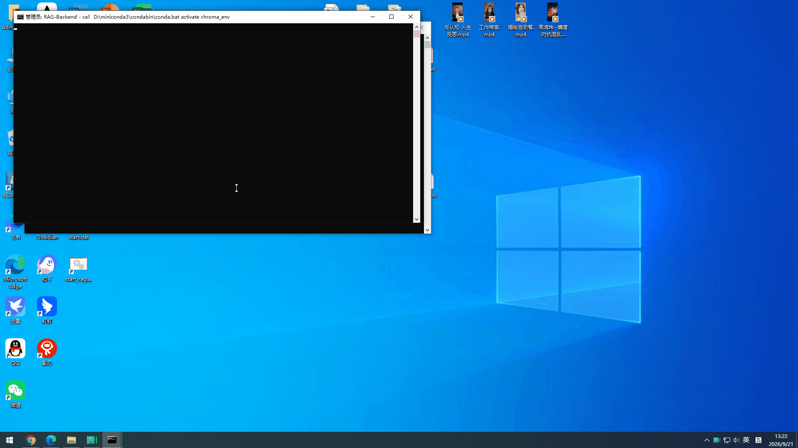
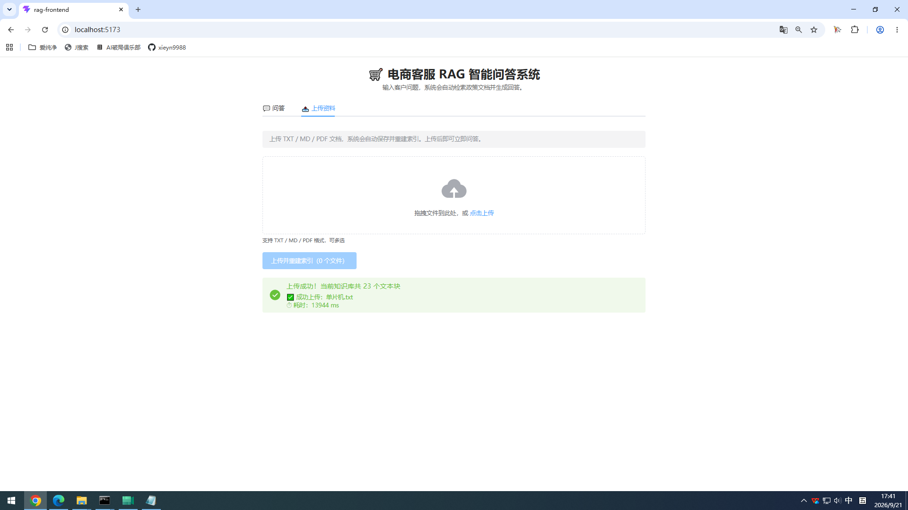
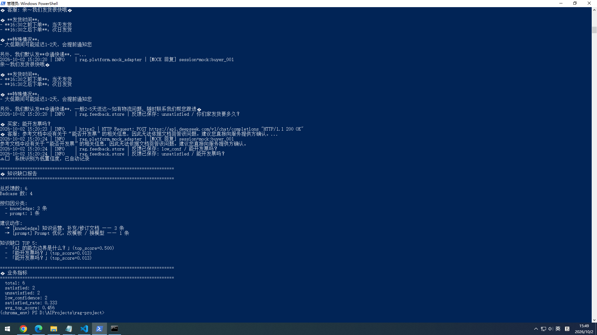

# 电商客服 RAG 智能问答系统

> 基于 **LangChain + ChromaDB + BGE + DeepSeek** 的电商客服 RAG 系统。**Vue3 全栈前端 + FastAPI + Streaming 流式输出 + 上传资料（现传现用）+ 业务闭环（反馈归因）**，Docker 一键部署。


---

## 💡 项目背景

**痛点**：电商客服每天重复回答大量问题：

- "这个商品支持 7 天无理由退货吗？"
- "快递到不了了，怎么申请补发？"
- "满减活动什么时候结束？"

**传统方案**：客服翻文档、查政策、复述给用户，平均响应 2-3 分钟。

**本项目**：把商品信息、售后政策、物流规则导入知识库，客服输入问题，系统自动检索并生成带**引用来源**的回答。

---

## 📊 项目亮点

- **⚡ Streaming 流式输出**：SSE 协议逐 token 推送，用户看到打字机效果
- **📤 上传资料（现传现用）**：上传新政策 → 系统自动 ingest → 客服立即能问
- **🎯 Reranker 精排 + 引用追溯**：向量召回 + CrossEncoder 精排，附原文片段
- **🔄 业务闭环**：反馈采集 → Badcase 归因 → 知识缺口报告 → 知识迭代
- **🔌 平台适配层**：抽象 `PlatformAdapter`，支持 Webhook 接入京麦/千牛/抖店
- **🖥 全栈实现**：Vue3 + FastAPI + CLI，Docker 一键部署

---

## 🖼️ 效果演示

### 流程展示（Vue3 + Element Plus）



- 回答**逐字出现**（打字机效果）
- 附带 **📚 引用来源**（含相似度）

### 上传资料界面



**示例**：

> **提问**："我买的洗发水用了过敏，能退吗？"
>
> **回答**：可以的。根据《售后服务政策 v2.3》，化妆品类商品如使用后出现过敏反应，可在签收后 15 天内申请退货，需提供医院过敏证明...
>
> **引用来源**：
> - [1] HFP客服知识库.txt（相似度 0.9573）
> - [2] HFP客服知识库.txt（相似度 0.8142）

### 业务闭环演示（Badcase 归因）



---

## ✨ 核心功能

### 🎯 RAG 问答

- **多格式文档摄入**：PDF / TXT / Markdown
- **中文语义检索**：`BAAI/bge-small-zh-v1.5` embedding + ChromaDB
- **精排重排序**：`BAAI/bge-reranker-base` CrossEncoder 精排
- **LLM 生成**：DeepSeek Chat 基于检索内容生成，避免幻觉
- **来源引用**：每个回答附带原文片段和相似度，可追溯

### 📤 上传资料（现传现用）

**核心能力**：上传文档 → 系统立即学会 → 用户就能问它。

**工作流程**：

1. 管理员上传新政策文档（TXT / MD / PDF）
2. 系统自动：切块 → embedding → 存入 ChromaDB
3. **重置 RAGChain 单例**（避免 collection 句柄失效）
4. 客服即可基于新政策问答

**电商场景价值**：

| 场景 | 传统方案 | RAG 方案 |
|------|----------|----------|
| 公司出了新政策 | 写文档 → 培训客服 → 客服背下来 | **上传文档 → 系统立即生效** |
| 客服流动 | 新员工培训 3 天才能上岗 | **第一天就能用系统辅助** |

### 🔄 业务闭环（自进化系统）

系统不是单向的"问答管道"，而是带反馈的**自进化系统**。

**闭环流程**：

```
用户提问 → RAG 回答 → 反馈采集 → Badcase 归因 → 知识更新 → 效果验证
   ↑                                                              │
   └────────────────────── 迭代循环 ──────────────────────────────┘
```

**五个环节**：

| 环节 | 实现 | 代码位置 |
|------|------|---------|
| **感知** | 显式反馈（👍/👎）+ 隐式信号（低置信度自动触发） | `src/rag/feedback/collector.py` |
| **诊断** | 规则引擎归因：知识缺失 / 检索问题 / Prompt 问题 | `src/rag/feedback/triage.py` |
| **治疗** | 自动生成知识缺口报告，指导文档补充 | `src/rag/feedback/knowledge_gap.py` |
| **度量** | 聚合指标：满意率、平均检索分、Badcase 分布 | `src/rag/feedback/metrics.py` |
| **迭代** | 知识运营 → 补充文档 → 重建索引 → 验证 | `scripts/ingest.py` |

**归因规则**：

| 检索分数 | 归因 | 建议动作 |
|---------|------|---------|
| 无检索结果 | `KNOWLEDGE` | 知识运营：补充文档 |
| top_score < 0.5 | `KNOWLEDGE` | 知识覆盖不足，补充文档 |
| 0.5 ≤ top_score < 0.7 | `RETRIEVAL` | 工程优化：调 chunk_size / top_k / Reranker |
| top_score ≥ 0.7 但用户不满意 | `PROMPT` | Prompt 优化 / 换模型 |

**演示**：

```bash
python scripts/demo_closed_loop.py
```

**输出示例**：

```
知识缺口报告
============================================================
总反馈数: 6
Badcase 数: 4

按归因分类:
  - knowledge: 3 条       → 知识运营：补充/修订文档
  - retrieval: 1 条       → 工程优化：调 chunk_size / top_k / Reranker

知识缺口 TOP 5:
  - 「你们家发货要多久？」(top_score=0.123)
  - 「能开发票吗？」(top_score=0.089)

业务指标
============================================================
satisfied_rate: 0.333
avg_top_score: 0.456
```

### 🔌 平台适配层（对接真实电商平台）

**设计目标**：不替换京麦/千牛，而是作为它们的"AI 增强外挂"，通过官方 OpenAPI 合规接入。

**架构**：

```
┌──────────────────────────────────────┐
│   电商平台（京麦 / 千牛 / 抖店）       │
└──────────────┬───────────────────────┘
               │ ① Webhook 推送买家消息
               ▼
┌──────────────────────────────────────┐
│   PlatformAdapter（抽象）             │
│   ├── MockAdapter       ✅ 已实现     │
│   ├── JingmaiAdapter    📋 待接入     │
│   └── QianniuAdapter    📋 待接入     │
└──────────────┬───────────────────────┘
               │ 统一消息模型
               ▼
┌──────────────────────────────────────┐
│   RAGChain（检索 + 重排 + 生成）       │
└──────────────┬───────────────────────┘
               │ ② 调用 sendMsg 回复
               ▼
┌──────────────────────────────────────┐
│   Feedback Loop（归因 + 知识缺口）     │
└──────────────────────────────────────┘
```

**当前状态**：

- ✅ Mock 适配器完整可用，可本地验证链路
- 📋 京麦/千牛适配器骨架就绪，拿到 ISV 资质后可快速填充
- 🔒 合规设计：签名验证、幂等去重、Webhook 5 秒响应约束

### ⚡ Streaming 流式输出

- **后端**：`StreamingResponse` 逐 token 推送
- **前端**：`fetch` + `ReadableStream` 逐块解析
- **效果**：首字立即展示

### 💬 三种使用入口

| 入口 | 状态 | 用途 |
|------|------|------|
| **Vue3 Web 界面** | ✅ 推荐 | 客服日常使用 |
| **FastAPI REST 接口** | ✅ 推荐 | 集成到现有客服系统 |
| **CLI 命令行** | ✅ 稳定 | 开发和脚本调用 |

### 🐳 工程化

- **Docker 一键部署**：`docker compose up -d`
- **一键启动脚本**：`start_rag.bat`（Windows）
- **配置外置**：`.env` + Pydantic Settings
- **日志轮转**：RotatingFileHandler
- **全链路自检**：`python scripts/check_all.py`

---

## 🏗️ 系统架构

```
┌─────────────────────────────────────────────────────┐
│         用户浏览器 (Vue3)                             │
│      💬 问答  |  📤 上传资料                          │
└─────────────────┬───────────────────────────────────┘
                  │ HTTP / SSE 流式
                  ▼
┌─────────────────────────────────────────────────────┐
│         Nginx / Vite Proxy                          │
└─────────────────┬───────────────────────────────────┘
                  ▼
┌─────────────────────────────────────────────────────┐
│         FastAPI 后端 (:8000)                        │
│  Routes → Service → RAGChain (单例)                │
│  ├── /query             非流式问答                   │
│  ├── /query/stream      流式问答（SSE）              │
│  └── /ingest/upload     上传资料 + 重建索引          │
├──────────────┬──────────────┬───────────────────────┤
│  Embedding   │  VectorStore │  LLM                  │
│  (BGE-zh)    │  (ChromaDB)  │  (DeepSeek)           │
├──────────────┴──────────────┴───────────────────────┤
│  🔄 Feedback Loop  (反馈采集 → 归因 → 知识缺口)      │
├─────────────────────────────────────────────────────┤
│  🔌 Platform Adapter  (Mock / 京麦 / 千牛)          │
└─────────────────────────────────────────────────────┘
```

---

## 🛠️ 技术栈

| 组件 | 技术 |
|------|------|
| **前端** | Vue3 + Element Plus + Axios |
| **后端** | FastAPI + Uvicorn |
| **RAG 框架** | LangChain |
| **向量数据库** | ChromaDB |
| **Embedding** | BAAI/bge-small-zh-v1.5 |
| **Reranker** | BAAI/bge-reranker-base |
| **LLM** | DeepSeek Chat |
| **流式协议** | SSE（Server-Sent Events） |
| **配置** | Pydantic Settings |
| **部署** | Docker + Compose |

---

## 🚀 快速开始

### 前置条件

- Python 3.10+
- Node.js 18+
- （可选）Docker Desktop

### 方式一：一键启动脚本（Windows）

双击 `start_rag.bat`，自动：
1. 启动 FastAPI 后端（:8000）
2. 启动 Vue3 前端（:5173）
3. 轮询 `/health` 等后端就绪
4. 自动打开浏览器

### 方式二：手动启动

```bash
# 1. 克隆
git clone https://github.com/xieyn9988/rag-project.git
cd rag-project

# 2. 虚拟环境
conda create -n chroma_env python=3.10 -y
conda activate chroma_env

# 3. 依赖
pip install -e ".[dev]"

# 4. 配置
cp .env.example .env
# 编辑 .env，填入 DeepSeek API Key

# 5. 摄入数据
python scripts/ingest.py --rebuild

# 6. 后端（CMD 1）
python apps/fastapi_app.py

# 7. 前端（CMD 2）
cd rag-frontend && npm install && npm run dev

# 8. 浏览器
# http://localhost:5173
```

### 方式三：Docker 一键部署

```bash
cp .env.example .env
docker compose up -d

# 前端：http://localhost
# API 文档：http://localhost:8000/docs
```

---

## 📖 使用说明

### 客服日常使用（Vue3 界面）

浏览器 `http://localhost:5173`：

- **💬 问答 Tab**：输入问题，回答逐字出现，附带引用来源
- **📤 上传资料 Tab**：拖拽 TXT/MD/PDF，点击上传，系统自动重建索引

### 集成到现有客服系统（API）

**非流式接口**：

```bash
curl -X POST http://localhost:8000/query \
  -H "Content-Type: application/json" \
  -d '{"question": "洗发水过敏能退吗？", "top_k": 2}'
```

**响应**：

```json
{
  "question": "洗发水过敏能退吗？",
  "answer": "可以的。根据《售后服务政策》...",
  "references": [
    {"source": "HFP客服知识库.txt", "score": 0.9573}
  ],
  "elapsed_ms": 2340
}
```

**流式接口（SSE）**：

```bash
curl -X POST http://localhost:8000/query/stream \
  -H "Content-Type: application/json" \
  -d '{"question": "退货", "top_k": 2}'
```

**响应流**：

```
data: {"type": "content", "text": "亲~"}
data: {"type": "content", "text": "关于退货..."}
data: {"type": "references", "references": [{"source": "HFP客服知识库.txt", "score": 0.9573}]}
data: [DONE]
```

**上传资料接口**：

```bash
curl -X POST http://localhost:8000/ingest/upload \
  -F "files=@data/text/新政策.md"
```

---

## ⚙️ 配置

| 变量 | 默认值 | 说明 |
|------|--------|------|
| `RAG_LLM_API_KEY` | - | DeepSeek API Key |
| `RAG_LLM_MODEL` | `deepseek-chat` | 模型名 |
| `RAG_EMBED_MODEL` | `BAAI/bge-small-zh-v1.5` | Embedding 模型 |
| `RAG_RERANK_MODEL` | `BAAI/bge-reranker-base` | 重排序模型 |
| `RAG_CHUNK_SIZE` | `500` | 文本块大小 |
| `RAG_TOP_K` | `2` | 检索文档数 |
| `HF_ENDPOINT` | `https://hf-mirror.com` | HuggingFace 镜像 |

---

## 📝 设计要点

1. **分层架构**：`interface / service / chain / infra` 四层分离
2. **抽象接口**：`Embedder / VectorStore / LLM` 三个 ABC，换供应商不改业务代码
3. **Reranker 精排**：`top_k × 3` 召回 → CrossEncoder 精排 → `top_k`
4. **单例管理**：`RAGChain` 全局复用，避免每次请求重载 BGE 模型
5. **上传后重置单例**：ingest 后 collection 句柄失效，必须重置 RAGChain
6. **反馈闭环**：RAG 质量 70% 取决于知识质量，闭环让"用户不满意"变成"知识补充"输入
7. **归因规则**：200 行规则，准确性高于 AI、成本为零、可解释
8. **平台适配层**：抽象 `PlatformAdapter`，业务代码不耦合平台 API
9. **国内网络优化**：`HF_ENDPOINT=hf-mirror.com` 避免模型下载超时

---

## 🎯 技术边界

**不是所有 PDF 都能解析**：

- ✅ 结构化单页 PDF
- ✅ 电子档 PDF（可选中文字）
- ⚠️ 扫描件 PDF → 需 OCR，暂不支持
- ⚠️ 多页切分式宽表 PDF → 暂不支持

**建议**：PDF 请先另存为 Excel/CSV/TXT 后上传。

**平台对接边界**：

- ✅ Mock 适配器本地完整可用
- ⚠️ 京麦/千牛真实接入需要 ISV 资质
- 📋 适配器骨架已就位，拿到资质后可快速填充

---

## 🔮 未来规划

- [ ] **真实平台接入**：填实京麦/千牛适配器
- [ ] **多轮对话记忆**：基于 LLM 的历史压缩
- [ ] **多租户隔离**：不同企业独立知识库
- [ ] **Voice RAG**：集成 Whisper
- [ ] **可观测性**：Prometheus + Grafana
- [ ] **灰度 A/B**：优化方案灰度发布

---

## 📄 License

MIT

## 🙏 致谢

- [LangChain](https://github.com/langchain-ai/langchain)
- [ChromaDB](https://github.com/chroma-core/chroma)
- [BAAI BGE](https://github.com/FlagOpen/FlagEmbedding)
- [DeepSeek](https://www.deepseek.com/)